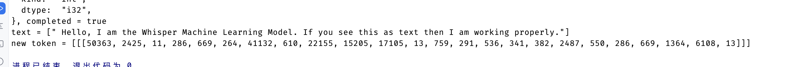
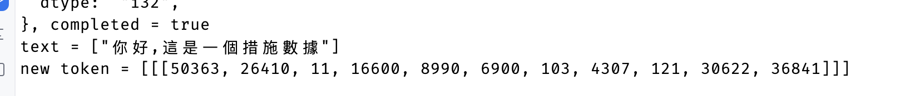

# Whisper Burn: Rust Implementation of OpenAI's Whisper Transcription Model

**Whisper Burn** is a Rust implementation of OpenAI's Whisper transcription model using the Rust deep learning framework, Burn.

## License

This project is licensed under the terms of the MIT license.

## Current result

I have tested two sample audios:

